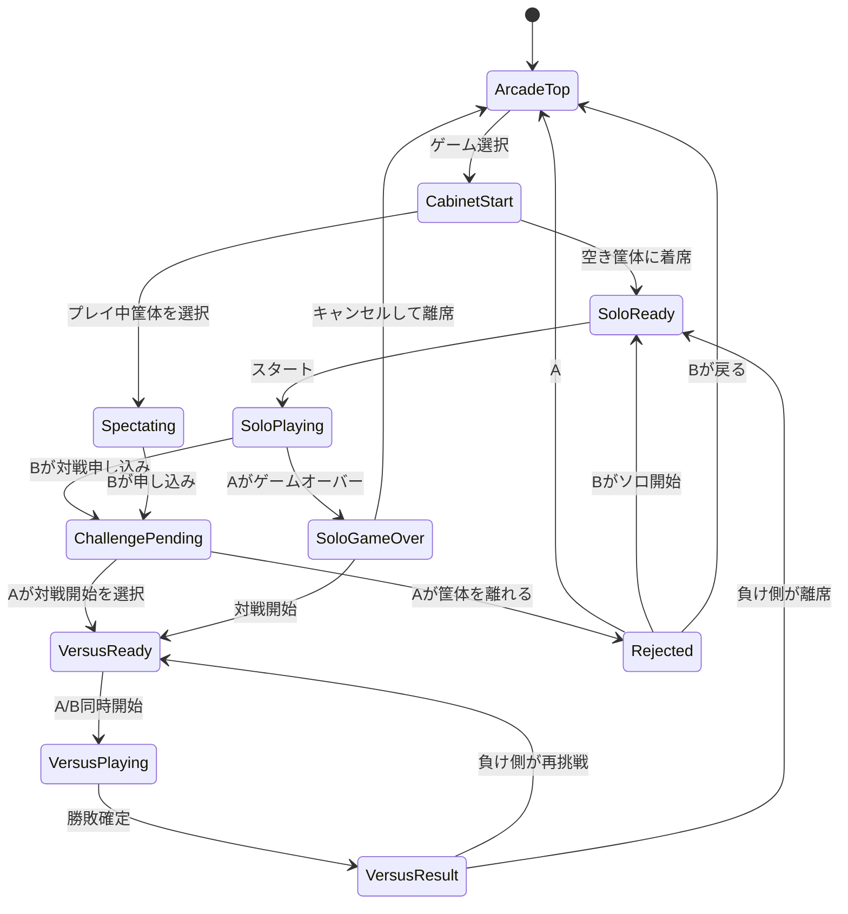

# ゲームセンター対戦システム設計

## 目的

現在のソロプレイ型プロトタイプを、ゲームセンター内の「筐体」を中心にした観戦・乱入・対戦体験へ拡張する。

初期実装では筐体は1台のみ、クレジット消費なしのフリープレイとする。将来、複数筐体、クレジット、観戦者チャット、複数ゲーム対応へ拡張できる構成にする。

## 前提

- フロントエンドはCloudflare Pagesで配信する。
- ランキング保存は既存のCloudflare Workers + D1を利用する。
- リアルタイム同期はCloudflare Durable Objects + WebSocketを使う。
- 初期版では厳密な不正対策よりも、遊べる検証体験を優先する。
- 初期版では1ゲーム、1筐体、最大2プレイヤー、複数観戦者を対象にする。

## 用語

- **ゲームセンター**: ゲーム一覧と筐体一覧を表示するトップ画面。
- **ゲーム**: 現在は `Graze Duel` のみ。
- **筐体**: ゲームを遊ぶ単位。現在は1台固定。
- **席**: 筐体上のプレイヤー枠。`seatA`, `seatB`。
- **プレイヤーA**: 最初に筐体でプレイ開始したプレイヤー。
- **プレイヤーB**: 観戦後、対戦申し込みするプレイヤー。
- **観戦者**: プレイ映像を見るユーザー。対戦申し込み前のBも観戦者扱い。
- **ソロプレイモード**: AがCPU相手に遊ぶ状態。
- **対戦モード**: AとBが同時に開始し、CPUではなく相手プレイヤーと勝負する状態。
- **フリープレイモード**: クレジット消費なしで開始・再挑戦できる状態。

## ユーザー導線

### 1. ゲームセンタートップ

プレイヤーはゲームセンターのトップページに入る。

表示する情報:

- ゲーム一覧
- 各ゲームの筐体状態
- 初期版では `Graze Duel` と筐体1台のみ

筐体状態:

- `empty`: 空席
- `soloPlaying`: ソロプレイ中
- `challengePending`: 対戦申し込みあり
- `versusPlaying`: 対戦中
- `gameOver`: ゲーム終了中

### 2. ゲーム選択・筐体選択

プレイヤーAがゲームを選ぶと、対象ゲームのスタート画面に遷移する。

初期版:

- 筐体は1台だけなので自動選択する。
- 空いていればAが着席状態になる。
- 既に誰かがプレイ中なら観戦モードに入る。

将来:

- プレイ中の筐体を選んで観戦・乱入する。
- 空き筐体を選んでソロプレイする。
- 人気筐体には観戦者や順番待ちが発生する。

### 3. ソロプレイ開始

Aがスタートボタンを押すとゲーム開始。

初期版:

- クレジット消費なし。
- CPU相手のソロプレイモード。
- ゲーム終了後もリスタート無料。

将来:

- スタート時に1クレジット消費。
- リスタート時にも1クレジット消費。

### 4. 観戦

Bがゲームセンターに入り、Aがプレイ中の筐体を選ぶ。

Bは観戦モードになり、Aのプレイ映像をリアルタイムに見る。

初期版の観戦同期:

- A側が定期的にゲーム状態スナップショットを送る。
- B側はそのスナップショットを描画する。
- 入力は送らない。

将来:

- 観戦者同士の会話。
- 遅延リプレイ。
- 観戦中の応援・スタンプ。

### 5. 対戦申し込み

Bは観戦画面から対戦申し込みできる。

初期版:

- クレジット消費なし。
- Bの状態を `challengerWaiting` にする。
- Aの画面に「対戦者待ち」を表示する。
- Aの画面に「対戦開始」ボタンを表示する。

将来:

- 対戦申し込み時に1クレジット消費。
- Aが拒否した場合のクレジット返却ルールを決める。
- 複数申し込み時は待ち行列にする。

### 6. Aがプレイ中の場合

Aがソロプレイ中にBが申し込んだ場合:

- Aのプレイは継続する。
- Aの画面に `対戦者待ち` ステータスを表示する。
- Aは任意タイミングで `対戦開始` を押せる。
- `対戦開始` 押下でソロプレイを終了し、A/B同時に対戦モードを開始する。

考慮:

- Aがボス戦中などに押せるとプレイが中断される。
- 初期版では中断を許可する。
- 将来は「現在のプレイ終了後に対戦」も選べるようにする。

### 7. Aがゲームオーバーした場合

Aがゲームオーバーした時点で対戦申し込みがある場合:

Aは次の選択をする。

- `対戦開始`: Bとの対戦モードへ移行
- `キャンセルして筐体を離れる`: Aはゲームセンタートップへ戻る

Aが筐体を離れた場合:

- Bには申し込み拒否として通知する。
- Bは次を選ぶ。
  - ソロプレイを開始する
  - ゲームセンタートップへ戻る

### 8. 対戦モード

AとBが同時にゲームを開始する。

対戦モードではCPUを使わず、双方がそれぞれ自分のフィールドでプレイする。

同期方針:

- 初期版は「入力同期」よりも「状態同期」を優先する。
- 各プレイヤーのゲーム状態をサーバーへ送る。
- サーバーは相手の状態・攻撃イベント・勝敗状態を中継する。
- 攻撃弾はイベントとして同期する。

## 勝敗ルール

対戦モードの勝敗は以下の優先順位で決める。

1. 両者がラスボスを倒した場合、クリアタイムが早い方の勝ち。
2. 片方だけがラスボスを倒した場合、倒した方の勝ち。
3. 両者とも倒せなかった場合、スコアが高い方の勝ち。
4. スコアも同点の場合、最大到達レベルが高い方の勝ち。
5. それも同じなら引き分け。

勝敗判定に使う結果:

```ts
type GameResult = {
  playerId: string;
  cleared: boolean;
  clearTimeMs: number | null;
  score: number;
  maxLevel: number;
  defeatedBossCount: number;
  endedAt: number;
};
```

## 対戦後の導線

負けた側:

- `再挑戦`
- `やめる`

勝った側:

- 相手が再挑戦を選んだ場合、再戦待ちになる。
- 相手がやめた場合、ソロプレイモードに戻って新しいゲームを開始できる。

初期版:

- 再挑戦もクレジット消費なし。

将来:

- 再挑戦には1クレジット必要。
- 勝者側は連勝数を表示できる。

## システム状態設計

### Arcade State

ゲームセンター全体の状態。

```ts
type ArcadeState = {
  games: GameSummary[];
};

type GameSummary = {
  gameId: "graze-duel";
  title: string;
  cabinets: CabinetSummary[];
};

type CabinetSummary = {
  cabinetId: string;
  status: CabinetStatus;
  playerCount: number;
  spectatorCount: number;
};
```

### Cabinet State

筐体単位の状態。初期版ではDurable Object 1つが筐体1台を表す。

```ts
type CabinetStatus =
  | "empty"
  | "occupied"
  | "soloPlaying"
  | "challengePending"
  | "versusReady"
  | "versusPlaying"
  | "result";

type CabinetState = {
  cabinetId: string;
  gameId: string;
  status: CabinetStatus;
  freePlay: boolean;
  seatA: SeatState | null;
  seatB: SeatState | null;
  spectators: SpectatorState[];
  challenge: ChallengeState | null;
  match: MatchState | null;
  updatedAt: number;
};
```

### Seat State

```ts
type SeatState = {
  playerId: string;
  displayName: string;
  connectionId: string;
  ready: boolean;
  mode: "solo" | "versus";
};
```

### Challenge State

```ts
type ChallengeState = {
  challengerId: string;
  challengerName: string;
  requestedAt: number;
  status: "pending" | "accepted" | "rejected" | "cancelled";
};
```

### Match State

```ts
type MatchState = {
  matchId: string;
  mode: "solo" | "versus";
  startedAt: number | null;
  status: "waitingStart" | "playing" | "finished";
  results: Record<string, GameResult>;
};
```

## 状態遷移



## リアルタイム通信設計

### 採用方針

Cloudflare Durable Objectsを筐体ごとのリアルタイム司令塔にする。

理由:

- 1つの筐体に参加するA/B/観戦者を1つのDurable Objectへ集約できる。
- WebSocketで双方向通信できる。
- 筐体状態をDurable Object内で一貫して管理できる。
- 将来、筐体IDごとにDurable Objectを分けられる。

### 接続

```text
Browser
  -> Cloudflare Pages
  -> Worker /api/cabinets/:cabinetId/ws
  -> Durable Object CabinetRoom
```

### メッセージ種別

Client -> Server:

```ts
type ClientMessage =
  | { type: "joinCabinet"; playerName: string }
  | { type: "startSolo" }
  | { type: "watch" }
  | { type: "requestChallenge" }
  | { type: "acceptChallenge" }
  | { type: "rejectChallenge" }
  | { type: "leaveCabinet" }
  | { type: "playerInput"; input: InputState; seq: number }
  | { type: "gameSnapshot"; snapshot: GameSnapshot; seq: number }
  | { type: "attackEvent"; event: AttackEvent; seq: number }
  | { type: "gameResult"; result: GameResult };
```

Server -> Client:

```ts
type ServerMessage =
  | { type: "cabinetState"; state: CabinetState }
  | { type: "viewerSnapshot"; snapshot: GameSnapshot }
  | { type: "challengeRequested"; challengerName: string }
  | { type: "challengeAccepted" }
  | { type: "challengeRejected" }
  | { type: "versusStart"; matchId: string; seed: number; startAt: number }
  | { type: "opponentSnapshot"; snapshot: GameSnapshot }
  | { type: "opponentAttack"; event: AttackEvent }
  | { type: "matchResult"; result: MatchResult }
  | { type: "error"; message: string };
```

## ゲーム同期設計

### 初期版の実装方針

最初から完全な同期対戦を狙うと重い。初期版では以下に分ける。

1. **観戦同期**
   - Aのゲーム状態をBへ送る。
   - Bは受信した状態を描画する。
   - Bの入力はゲームに影響しない。

2. **対戦開始同期**
   - A/Bに同じ `matchId`, `seed`, `startAt` を配る。
   - 両者は同時にゲームをリセットして開始する。

3. **攻撃イベント同期**
   - かすり・レベルアップ・攻撃発生はローカルで処理。
   - 相手へ送る攻撃弾は `attackEvent` としてサーバー経由で中継する。

4. **結果同期**
   - クリア、ゲームオーバー、スコア、最大レベルを送る。
   - Durable Objectが勝敗を確定する。

### スナップショット

```ts
type GameSnapshot = {
  playerId: string;
  elapsedMs: number;
  player: {
    x: number;
    y: number;
    lives: number;
    score: number;
    level: number;
    gauge: number;
    combo: number;
    invincibleMs: number;
  };
  boss: {
    active: boolean;
    phaseIndex: number;
    hp: number;
    x: number;
    y: number;
  };
  bullets: SnapshotBullet[];
};
```

初期版では観戦用に10〜15fps程度で送る。

対戦中は全弾を完全同期するのではなく、相手に影響する攻撃イベントを同期する。

## 画面設計

### ゲームセンタートップ

表示:

- タイトル
- ゲームカード
- 筐体状態
- `遊ぶ` / `観戦する` ボタン

初期版:

- `Graze Duel`
- `筐体 1`
- 状態に応じてボタンを出す

### ゲームスタート画面

状態:

- 空き筐体: `スタート`
- プレイ中筐体: `観戦中`, `対戦申し込み`
- 対戦申し込み中: `申し込み中`

### Aのソロプレイ画面

追加表示:

- Bから申し込みが来たら `対戦者待ち`
- `対戦開始`
- `あとで`

### Bの観戦画面

表示:

- Aのプレイ画面
- `対戦申し込み`
- `ゲームセンターに戻る`

### 対戦結果画面

表示:

- 勝者
- A/Bのクリアタイム
- A/Bのスコア
- `再挑戦`
- `やめる`

## API設計

### HTTP API

```http
GET /api/arcade
```

ゲーム一覧・筐体一覧を取得する。

```http
POST /api/cabinets/:cabinetId/join
```

筐体に入る。空きならプレイヤー、使用中なら観戦者。

```http
GET /api/cabinets/:cabinetId/ws
```

WebSocket接続。

```http
POST /api/ranking
GET /api/ranking
```

既存ランキングAPIを維持。

## データ永続化

### D1

永続化するもの:

- ランキング
- 対戦履歴
- プレイヤー名
- 将来のクレジット履歴

初期追加テーブル案:

```sql
CREATE TABLE matches (
  id TEXT PRIMARY KEY,
  cabinet_id TEXT NOT NULL,
  mode TEXT NOT NULL,
  player_a_name TEXT,
  player_b_name TEXT,
  winner_name TEXT,
  started_at TEXT,
  ended_at TEXT
);

CREATE TABLE match_results (
  id INTEGER PRIMARY KEY AUTOINCREMENT,
  match_id TEXT NOT NULL,
  player_name TEXT NOT NULL,
  cleared INTEGER NOT NULL,
  clear_time_ms INTEGER,
  score INTEGER NOT NULL,
  max_level INTEGER NOT NULL,
  defeated_boss_count INTEGER NOT NULL,
  FOREIGN KEY (match_id) REFERENCES matches(id)
);
```

### Durable Object Storage

短期状態:

- 現在の筐体状態
- 接続中ユーザー
- 対戦申し込み
- 進行中マッチ

永続DBではなく、リアルタイム状態管理を主目的にする。

## クレジット設計

初期版:

```ts
freePlay = true;
```

クレジット消費箇所は処理だけ抽象化しておく。

```ts
type CreditAction =
  | "startSolo"
  | "requestChallenge"
  | "rematch";
```

将来:

- `startSolo`: 1クレジット
- `requestChallenge`: 1クレジット
- `rematch`: 1クレジット
- 拒否時の返却有無を決める

## 実装フェーズ

### Phase 1: 画面構造の分離

- ゲームセンタートップを追加
- ゲームスタート画面を追加
- 現在のゲーム画面を「筐体画面」として扱う
- 1筐体固定
- フリープレイ固定

目的:

- UXの骨格を作る。
- まだオンライン同期はしない。

### Phase 2: 観戦モード

- WebSocket接続を追加
- Aのゲーム状態をサーバーへ送信
- Bが観戦画面でAのプレイ状態を見る
- Durable Objectで筐体状態を管理

目的:

- 「誰かが遊んでいる筐体を見る」を成立させる。

ローカル検証ではViteの開発サーバーに筐体用WebSocketを追加し、本番移行時に同じメッセージ形式をCloudflare Durable Objectsへ置き換える。

### Phase 3: 対戦申し込み

- Bが対戦申し込み
- Aに `対戦者待ち` 表示
- Aが対戦開始・拒否・離席を選べる
- Bへ結果通知

目的:

- ゲーセンらしい乱入導線を成立させる。

### Phase 4: 対戦モード

- A/B同時スタート
- CPUを無効化
- 相手攻撃イベントを同期
- 結果をサーバーで集計
- 勝敗画面を表示

目的:

- 最小限のオンライン対戦を成立させる。

### Phase 5: 再挑戦・連戦

- 負け側の再挑戦
- 勝者側のソロ復帰
- 対戦履歴保存

目的:

- ゲームセンターの「負けた側がもう一回」を再現する。

### Phase 6: クレジット

- クレジット残高
- 消費・返却
- 購入導線
- 不正対策

目的:

- 将来の課金・運営モデルへ接続する。

## 初期実装で切るべき範囲

最初に全部作らない。

最初の実装対象:

- トップ画面
- 1筐体
- スタート画面
- ソロプレイ開始
- フリープレイ表示

次の実装対象:

- 観戦モード
- 対戦申し込み

後回し:

- クレジット
- 複数筐体
- チャット
- 完全同期
- 不正対策
- 複数ゲーム

## 技術リスク

### 1. 完全同期対戦は難易度が高い

弾幕ゲームは弾数が多く、毎フレーム全状態を同期すると重くなる。

対策:

- 初期版は攻撃イベント同期を中心にする。
- 観戦は低fpsスナップショットでよい。
- 厳密な競技性より体験検証を優先する。

### 2. A側ローカル処理を信頼すると不正可能

初期版では受け入れる。

将来:

- サーバー側でseedとイベントログを検証。
- 異常スコア・異常タイムをランキング除外。

### 3. スマホ通信遅延

リアルタイム対戦では遅延が体感に出る。

対策:

- プレイヤー自身の操作はローカル即時反映。
- 相手画面・攻撃イベントは遅延許容。
- 対戦開始だけ `startAt` で同期する。

## 推奨アーキテクチャ

```text
Cloudflare Pages
  - ゲームセンターUI
  - ゲーム画面
  - 観戦画面

Cloudflare Worker
  - HTTP API
  - WebSocket入口
  - Ranking API

Durable Object: CabinetRoom
  - 筐体状態
  - A/B/観戦者接続
  - 対戦申し込み
  - 対戦開始同期
  - 結果集計

D1
  - ランキング
  - 対戦履歴
  - 将来のクレジット履歴
```

## 次に決めること

実装前に決めるべき項目:

1. プレイヤー名は毎回入力か、ブラウザ保存か。
2. Bの観戦画面はAの画面だけを見るか、CPU側も含めて見るか。
3. 対戦開始時、Aのソロプレイを即中断してよいか。
4. 対戦時のゲームルールはソロと完全同一でよいか。
5. 対戦結果をランキングに含めるか、別ランキングにするか。

## 現時点の推奨

最初の実装は次の順番がよい。

1. ゲームセンタートップと筐体スタート画面を追加する。
2. 現在のゲームを「筐体1台のソロプレイ」として起動する。
3. 内部状態に `cabinet`, `mode`, `seat` を導入する。
4. その後、WebSocket観戦を追加する。
5. 観戦が安定してから対戦申し込みを追加する。

この順番なら、今のゲームを壊さずにゲームセンター化できる。
