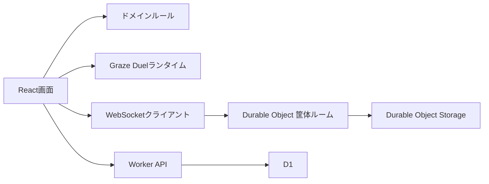
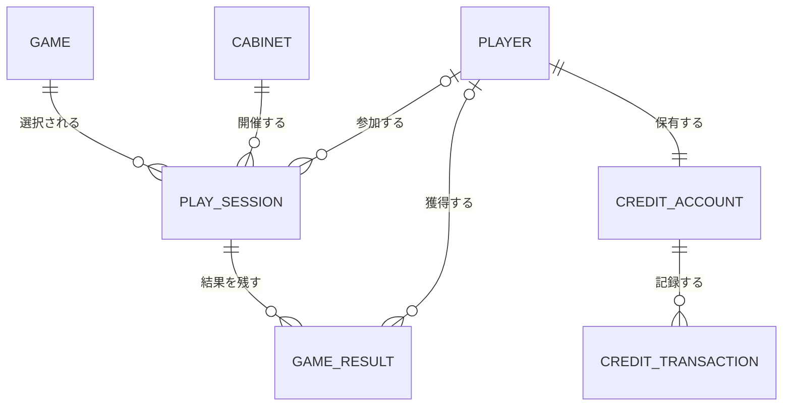

# アーキテクチャ

## 方針

ゲームセンターと個別ゲームを別の境界として扱います。プラットフォーム側はゲーム選択、筐体、プレイヤー、観戦、クレジット、結果を管理し、Graze Duel側はゲームルールと描画だけを担当します。

## 概念モデル

- **ゲーム**: プラットフォームに登録された遊戯単位
- **筐体**: URLで共有されるリアルタイムルーム。現在はDurable Objectが状態を保持
- **プレイヤー**: 将来のログイン主体。現段階では匿名
- **プレイセッション**: 筐体で始まる1回のソロ・対戦・協力プレイ
- **ゲーム結果**: クリア時間、スコア、レベル、勝敗などの不変記録
- **クレジット口座・取引**: 残高と増減履歴。現段階はフリープレイ
- **ランキング**: ゲーム結果を並べた読み取りモデル。独立した永続エンティティにはしない

## フロントエンド

- `ArcadeScreen`: ゲームセンタートップとゲーム一覧
- `CabinetScreen`: 個別筐体の状態、共有URL、着席・観戦への入口
- `GameScreen`: プレイ・観戦共通のゲーム表示領域
- `src/domain`: UIや通信に依存しない状態遷移
- `src/realtime`: 通信形式と再接続
- `src/games/graze-duel`: Graze Duel固有実装

Graze Duelの既存Canvas処理は挙動を壊さないため `legacy-runtime.js` に隔離しています。新しい画面、ドメイン、通信、APIはTypeScriptで実装し、ゲーム固有処理を変更する際は `core.ts`、`audio.ts` などへ段階的に移します。この互換層からプラットフォーム機能を増やさないことをルールとします。

## リアルタイム通信

筐体IDごとにDurable Objectを1つ割り当てます。最初の接続者をプレイヤー、後続を観戦者として扱います。

- プレイヤーは弾生成イベント、位置更新、定期キーフレームを送信
- 観戦側は速度からローカル描画し、キーフレームで差分補正
- Durable Objectは最新状態を保持し、途中参加者へ再送
- Hibernation WebSocket APIでアイドル時の実行コストを抑制
- 観戦者からのゲーム操作メッセージは受理しない

対戦実装では、同じ筐体状態機械に `challengePending`、`versusReady`、`versusPlaying`、`result` を追加済みの状態として接続します。

## データ

D1には以下を保持します。

- `games`
- `players`
- `play_sessions`
- `game_results`
- `credit_accounts`
- `credit_transactions`
- `rankings`（既存API互換。将来は `game_results` からの読み取りへ移行）

ゲーム中の高頻度な位置や弾情報はD1に保存せず、Durable ObjectとWebSocketだけで扱います。

## Cloudflare境界

`src/worker/index.ts` が唯一のWorker入口です。

- `/api/cabinets/:id/ws`: Durable Objectへ転送
- `/api/ranking`: D1ランキングAPI
- `/api/health`: 動作確認
- その他: Workers Static Assets

本番だけBasic認証を有効にし、認証情報はWorker Secretで管理します。ローカルおよび同一LANのプライベートIPは開発確認のため認証対象外です。
