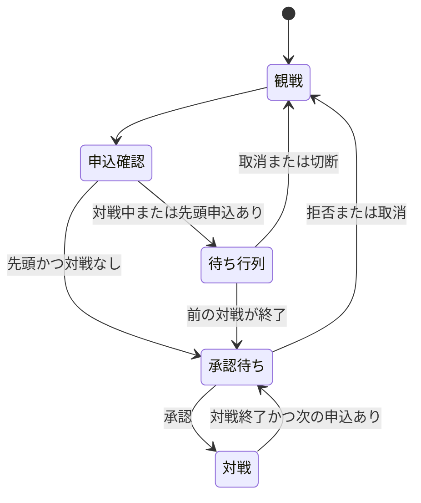

# 対戦申し込み待ち行列

## 責務

待ち行列はゲームルールから独立した筐体機能として Durable Object が管理する。

- 先頭申込者: プレイヤーの承認待ち
- 後続申込者: 最大5人のFIFO待ち行列
- 対戦・再挑戦中: 待ち行列を維持
- 対戦終了・申込拒否: 待ち行列の先頭を承認待ちへ自動昇格
- 取消・切断: 行列から除外し、仮クレジットを返却

## 状態遷移

## 設計上の判断

- 待ち人数は現在の承認対象を含めず、後続の行列人数とする。
- 再挑戦は現在の対戦者を優先し、待ち行列はその間維持する。
- 仮クレジットの有効期限は待機を考慮して2時間とする。
- クライアント切断時の返却はクライアント任せにせず、筐体DOからD1へ直接反映する。
- 同時申込で6人目になった場合はサーバーが拒否し、予約済みクレジットを返却する。
