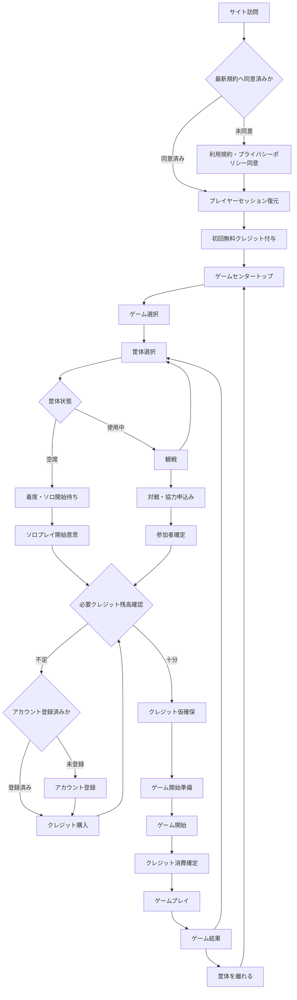
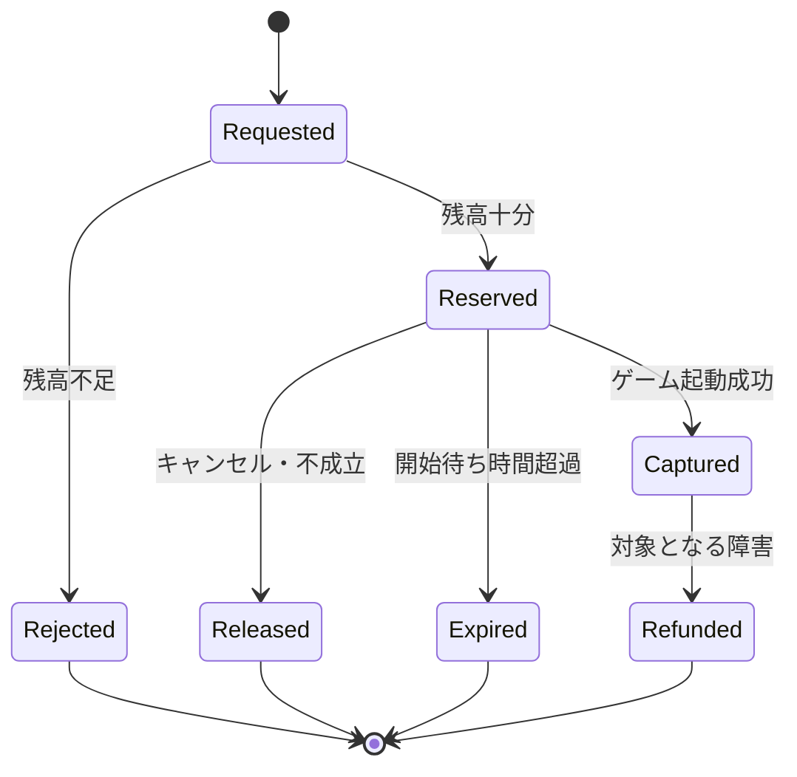
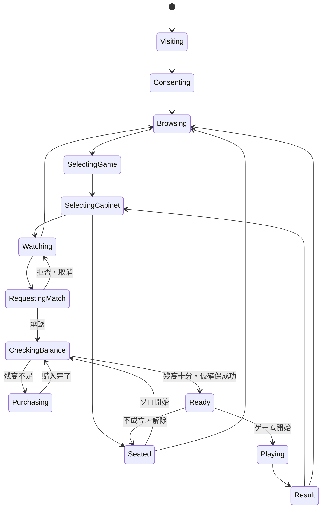
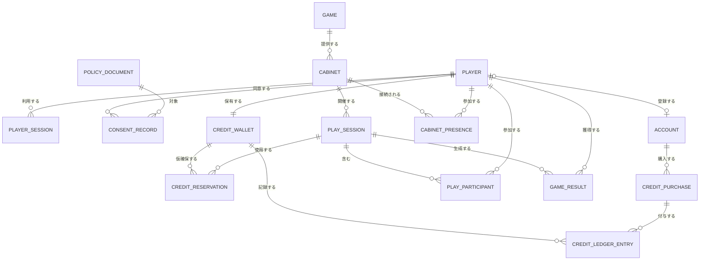

# ゲームセンター体験・運営設計

## 目的

プレイヤーがサイトを訪問してから離脱するまでの体験と、それを安全に運営するための機能を定義する。

個別ゲームのルールや描画は対象外とし、ゲームセンタープラットフォームが管理する以下を対象とする。

- 利用規約への同意
- 匿名プレイヤーとアカウント
- 無料・有料クレジット
- ゲーム・筐体選択
- 観戦
- ソロ・対戦・協力プレイ
- クレジット確認・仮確保・消費・返却
- 決済
- 問い合わせ・通報・障害対応

## 基本方針

1. 観戦とゲーム選択はクレジット不要とする
2. アカウント登録前でも無料クレジットで遊べる
3. クレジット残高不足は、仮確保より前に判定する
4. クレジット仮確保は、プレイ参加条件が揃った後に行う
5. クレジットは残高の直接更新ではなく、台帳から計算する
6. 無料クレジットと有料クレジットを分離する
7. 決済導入前に、無料クレジットだけで一連の体験を完成させる
8. 筐体のリアルタイム状態と、金銭・同意・結果の永続データを分離する

## 全体体験

## 残高不足の扱い

残高不足は、クレジット仮確保を試みた結果として初めて判明するのではなく、プレイ意思が確定した直後に明示的に確認する。

### ソロプレイ

1. プレイヤーがゲーム開始を選択する
2. 必要クレジット数と現在残高を表示する
3. 残高を確認する
4. 不足時は購入またはキャンセルを選択する
5. 購入完了後、元の筐体とプレイ意思へ戻る
6. 残高が十分なら仮確保する
7. ゲーム起動成功後に消費を確定する

### 対戦・協力プレイ

1. 観戦者が対戦または協力を申し込む
2. 筐体プレイヤーが承認する
3. 参加者全員の必要残高を事前確認する
4. 一人でも不足していれば、まだ誰の残高も仮確保しない
5. 不足した本人だけに購入導線を表示する
6. 一定時間内に残高が揃えば、参加者全員分を一括で仮確保する
7. 時間切れまたはキャンセルなら申込み状態を解除する
8. ゲーム起動成功後に全員分の消費を確定する

事前確認と仮確保の間に別端末で残高が変わる可能性があるため、仮確保時にもサーバー側で最終残高条件を検証する。

## アカウント登録機能（検討メモ）

### 予定する仕様

- 外部IdPと連携してアカウントを登録できるようにする
- 最初に対応するIdPはGoogleとし、将来ほかのIdPを追加できる構成にする
- IdPから取得した名前とプロフィールアイコンを、初期プロフィールとして登録する
- 匿名プレイヤーとして保有していたクレジット残高とプレイ情報を、登録アカウントへそのまま引き継ぐ
- アカウント登録完了時に、登録特典として無料クレジットを5枚追加する
- 登録特典の付与は、一つのアカウントにつき一度だけ冪等に行う

登録後の利用可能残高は、匿名プレイヤー時点の残高に登録特典5クレジットを加えた値とする。新しいウォレットへ残高をコピーするのではなく、匿名プレイヤーと登録アカウントを安全に関連付け、既存のクレジット台帳を継続して利用する。

### 実装時期

現時点では、アカウント登録によって得られる強いメリットが登録特典以外に不足しているため、実装は保留する。ユーザーが登録したいと思える継続的なメリットを定義できた段階で実装する。

候補となるメリットは今後検討し、この文書へ追記する。

## クレジット設計

### 種類

| 種類 | 用途 | 購入 | 推奨消費順 |
|---|---|---:|---:|
| 無料クレジット | 初回特典、キャンペーン、障害補償 | 不可 | 1 |
| 有料クレジット | ユーザーが購入した残高 | 可 | 2 |
| 仮確保 | 開始準備中の利用不能残高 | 不可 | - |

無料クレジットと有料クレジットは、表示・台帳・有効期限・返金判断を分離する。

### 台帳イベント

- `free_granted`: 無料クレジット付与
- `purchased`: 有料クレジット購入
- `reserved`: プレイ開始前の仮確保
- `reservation_released`: 仮確保解除
- `consumed`: ゲーム開始による消費確定
- `refunded`: 障害・運営判断による返却
- `expired`: 有効期限による失効
- `adjusted`: 運営による補正

すべてのイベントに、重複実行を防ぐ `idempotency_key` を持たせる。

### 仮確保の状態

### 消費・返却ルール

- ゲーム画面を開いただけでは消費しない
- ゲームセッションが開始状態になった時点で消費する
- 対戦相手が揃わなければ返却する
- ゲーム起動前の切断は返却する
- 起動後のユーザー都合切断は原則返却しない
- プラットフォーム障害で正常に遊べなかった場合は自動返却候補とする
- 同一プレイセッションに対する消費は一度だけ許可する

## プレイヤーとアカウント

### 匿名プレイヤー

初回同意後にサーバーで匿名プレイヤーIDを発行し、安全なCookieでセッションを維持する。

匿名状態で可能なこと:

- 無料クレジット取得
- ゲーム選択
- 筐体選択
- 観戦
- ソロ・対戦・協力プレイ
- 一時的な表示名の使用

### 登録アカウント

以下を行う時点で登録を要求する。

- 有料クレジット購入
- 複数端末で残高を共有
- 購入履歴を確認
- 恒久的な戦績・フレンドを利用

匿名プレイヤーを登録アカウントへ昇格する際は、無料残高、規約同意、プレイ履歴を同じプレイヤーIDへ引き継ぐ。

### 無料クレジットの不正取得対策

- プレイヤーID単位で初回付与を一度だけ記録
- Cookie削除だけで再付与されない補助判定
- IPだけを本人識別として使用しない
- 短時間の大量取得をレート制限
- 不審時のみTurnstileを要求
- 本格運用前は無料付与上限を小さくする

Cloudflare Turnstileは登録、問い合わせ、購入などのフォーム保護に利用でき、サーバー側でトークン検証が必要となる。[Cloudflare Turnstile](https://developers.cloudflare.com/turnstile/get-started/)

## プレイヤー状態

## 筐体・プレイセッション状態

### 筐体

- `empty`: 空席
- `occupied`: プレイヤー着席中
- `soloPlaying`: ソロプレイ中
- `challengePending`: 対戦・協力申込み中
- `balancePending`: 参加者の残高確認中
- `creditReserved`: 全員分のクレジット仮確保済み
- `versusReady`: 対戦開始待ち
- `versusPlaying`: 対戦中
- `coopReady`: 協力開始待ち
- `coopPlaying`: 協力中
- `result`: 結果確認中
- `recovering`: 切断復帰待ち

### プレイセッション

- `created`
- `waiting_for_players`
- `checking_balance`
- `credit_reserved`
- `starting`
- `playing`
- `completed`
- `cancelled`
- `failed`

筐体状態はDurable Objectがリアルタイムに調整し、確定したプレイセッション、クレジット、結果はD1へ保存する。

Durable Objectsは同一筐体の接続者を一つの主体で調整でき、Hibernation WebSocket APIによりアイドル時も接続を維持しながらコストを抑えられる。[Cloudflare Durable Objects](https://developers.cloudflare.com/durable-objects/best-practices/websockets/)

## 離脱・切断・再接続

### ゲーム選択・観戦中

- WebSocket切断時に筐体の在席情報を解除する
- クレジット処理は発生しない
- 再訪時は同じ匿名プレイヤーセッションを復元する

### 着席中・仮確保前

- 一定時間再接続がなければ筐体を空席へ戻す
- クレジット処理は発生しない

### 仮確保後・ゲーム開始前

- 短い再接続猶予を設ける
- 猶予内に戻れば開始待ちへ復帰する
- 猶予を超えた場合はプレイセッションを取消し、仮確保を解除する

### ゲーム開始後

- ゲームごとに再接続猶予、CPU代行、敗北判定の方針を定義する
- ユーザー都合切断は自動返却しない
- プラットフォーム障害と判定した場合は返却対象にできる
- 対戦相手には「切断」「再接続待ち」「勝敗確定」を明示する

匿名プレイヤーの無料残高はサーバーに保存するが、Cookieを失った利用者の本人確認・残高復旧は保証しない。登録アカウントへ移行すると端末変更後も復旧可能にする。

## データモデル

### 追加・変更する主要テーブル

- `policy_documents`
  - 規約種別、バージョン、公開日時、本文ハッシュ
- `consent_records`
  - プレイヤー、規約種別、バージョン、同意日時
- `player_sessions`
  - 匿名セッション、期限、最終アクセス
- `accounts`
  - 認証主体、メールアドレス、状態、年齢区分
- `credit_wallets`
  - プレイヤーごとのウォレット
- `credit_ledger_entries`
  - 無料・有料区分、増減、理由、参照ID、冪等キー
- `credit_reservations`
  - プレイセッション、プレイヤー、仮確保量、期限、状態
- `credit_purchases`
  - 金額、通貨、購入クレジット、決済状態
- `play_participants`
  - プレイセッションごとの参加者、役割、結果
- `cabinet_presences`
  - 着席・観戦・切断・離脱履歴
- `support_tickets`
  - 問い合わせ、課金、通報、障害補償

既存の `credit_accounts.balance` は将来的にキャッシュ値として扱い、正本は台帳にする。無料・有料・仮確保可能額を区別できない現在形式のまま有料化しない。

## API境界

### 初期化・同意

- `GET /api/bootstrap`
  - プレイヤー、同意状況、残高、再開先を返す
- `POST /api/consents`
  - 規約バージョンへの同意を記録
- `POST /api/credits/free-grant`
  - 初回無料クレジットを冪等付与

### クレジット

- `GET /api/credits`
  - 無料、有料、仮確保、利用可能残高
- `POST /api/credit-reservations`
  - 単独または参加者全員分を仮確保
- `POST /api/credit-reservations/:id/capture`
  - 消費確定
- `POST /api/credit-reservations/:id/release`
  - 仮確保解除

複数参加者の仮確保はD1の一つのバッチトランザクション内で実行する。残高不足時にSQLが必ず失敗する制約またはトリガーを設け、一人でも条件を満たさなければ全件をロールバックさせる。単に条件付き `UPDATE` が0件になるだけでは失敗にならないため、アプリケーション側の事前確認だけに依存しない。D1の `batch()` は一連のSQLをトランザクションとして実行し、途中失敗時に全体をロールバックする。[Cloudflare D1](https://developers.cloudflare.com/d1/worker-api/d1-database/#batch)

### 決済

- `POST /api/purchases`
  - 購入セッション作成
- `POST /api/payments/webhook`
  - 決済事業者からの結果受信
- `GET /api/purchases/:id`
  - 購入状態確認

購入完了画面から直接クレジットを付与せず、署名検証済みWebhookを正として冪等付与する。

### 問い合わせ・通報

- `POST /api/support`
- `POST /api/reports`
- `GET /api/support/:id`

メール送信、通知、集計などは同期レスポンスから分離し、必要になった段階でCloudflare Queuesへ送る。[Cloudflare Queues](https://developers.cloudflare.com/queues/get-started/)

## 運営サイト

### 無料公開前

- 利用規約
- プライバシーポリシー
- 運営者情報
- 問い合わせ
- 退会・データ削除方法
- FAQ・遊び方
- 推奨動作環境
- メンテナンス情報
- 障害情報・ステータスページ
- コミュニティガイドライン
- 禁止行為
- 通報窓口
- 著作権・権利侵害申告窓口
- Cookie・外部送信情報

### 有料化前

- 特定商取引法に基づく表記
- クレジット利用規約
- 販売価格・支払方法・提供時期
- 有効期限
- 返金・キャンセル条件
- サービス終了時の残高取扱い
- 購入履歴
- 未成年者の購入上限
- 保護者同意
- 前払式支払手段に関する表示
- 決済障害時の補償方針

インターネットで有償サービスを販売する場合、価格、支払方法・時期、提供時期、返品・解除条件、事業者名・住所・電話番号などの表示が必要となる。[消費者庁](https://www.no-trouble.caa.go.jp/what/mailorder/advertising.html)

購入クレジットは前払式支払手段に該当する可能性がある。自家型前払式支払手段は基準日の未使用残高が1,000万円を超えた場合に届出などが必要となるため、有料化前に専門家確認を行う。[金融庁](https://www.fsa.go.jp/news/27/sonota/20151214-2.html)

個人情報を取得する場合は利用目的を事前に公表するか、取得後速やかに通知または公表する。[個人情報保護委員会](https://www.ppc.go.jp/personalinfo/legal/guidelines_tsusoku/)

## SLOと運用目標

初期は利用者への契約上の保証ではなく、内部運用目標として管理する。

| 対象 | 初期SLO |
|---|---:|
| ゲームセンタートップ稼働率 | 月間99.9% |
| 筐体接続成功率 | 99.5% |
| 観戦接続成功率 | 99.5% |
| クレジット二重消費 | 0件 |
| 決済済みクレジット付与 | 99.99%が30秒以内 |
| リアルタイム観戦遅延 | 95%が1秒以内 |
| 重大障害検知 | 5分以内 |
| 重大障害初報 | 30分以内 |
| 課金問い合わせ初回返信 | 1営業日以内 |
| その他問い合わせ初回返信 | 3営業日以内 |
| データRPO | 5分 |
| データRTO | 4時間 |

公開サイトにはステータスページ、障害履歴、計画メンテナンスを掲載する。SLAは法人向け契約が必要になった段階で別途定義する。

## 管理画面

### MVP

- プレイヤー検索
- 匿名・登録状態確認
- 無料クレジット付与履歴
- クレジット調整
- プレイセッション確認
- 筐体状態確認
- 問い合わせ一覧
- 通報一覧
- 障害補償

### 有料化

- 購入・決済照合
- Webhook失敗再処理
- 返金管理
- 有料残高と未使用残高集計
- 年齢区分・購入上限確認
- 規約バージョン管理
- 監査ログ

運営操作はすべて操作者、日時、理由、変更前後を監査ログへ保存する。

## 実装段階

### Phase 1: 匿名・無料クレジット

1. 規約文書と同意バージョン
2. 匿名プレイヤーセッション
3. 無料クレジット台帳
4. 初回無料付与
5. 残高表示
6. ソロ開始前の残高確認
7. 仮確保・消費・解除

### Phase 2: 対戦・協力

1. 対戦・協力申込み
2. 承認・拒否・取消
3. 参加者全員の残高事前確認
4. 全員分の一括仮確保
5. 開始・不成立・切断時の処理
6. 再戦と筐体離脱

### Phase 3: 運営

1. 問い合わせ
2. 通報・ブロック
3. 管理画面
4. 障害補償
5. ステータスページ
6. SLO計測

### Phase 4: アカウント・有料化

1. アカウント登録と匿名データ引継ぎ
2. 購入画面
3. 決済事業者連携
4. Webhookによる冪等付与
5. 購入履歴・返金
6. 未成年者対策
7. 法務・会計・資金決済法確認

## 最初の実装範囲

最初はPhase 1を完成させる。

画面としては以下を追加する。

1. 初回同意画面
2. ヘッダーの無料・有料クレジット表示
3. プレイ開始確認画面
4. 残高不足画面
5. クレジット仮確保中表示
6. クレジット返却通知
7. フッターの運営・規約リンク

有料クレジット購入ボタンはPhase 4まで実決済へ接続せず、「準備中」または開発環境限定とする。
