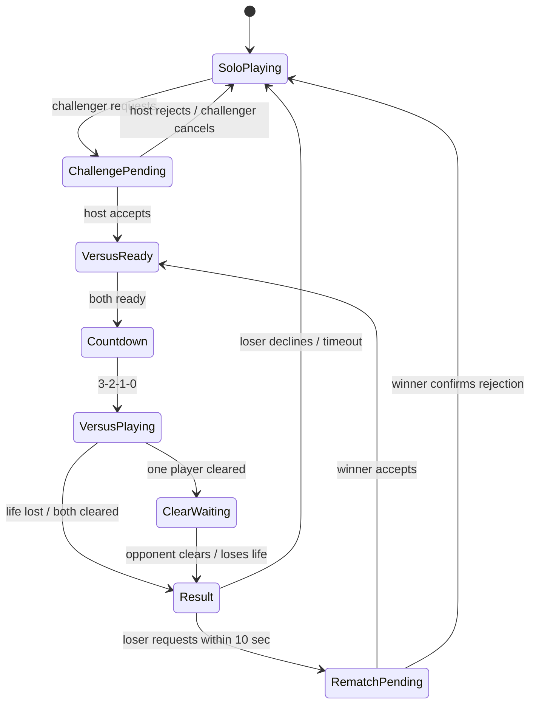

# Graze Duel 対戦フロー

## 基本方針

- 筐体の Durable Object を対戦状態の正本とする
- プレイヤーAを `host`、対戦を申し込んだプレイヤーBを `challenger` とする
- 対戦ゲームは各端末が自分側を計算し、相手側の表示用スナップショットと攻撃イベントだけを交換する
- PCでは自分を左、相手を右に表示する。スマホでは自分側だけを表示する
- クレジットは申込時に予約し、承諾時に確定、拒否・取消・期限切れ時に解放する

## 状態遷移

## 勝敗

- どちらかが最初に残機を1つ失った時点で、残機を維持した側の勝利
- 一方が先にオールクリアした場合、その側は停止して相手の終了を待つ
- 両方がオールクリアした場合は合計スコアが高い側の勝利
- 同点の場合はクリア時間が短い側、それも同じ場合は引き分け
- 対戦中の切断は切断した側の敗北

## 再挑戦

- 敗者だけが結果表示から10秒以内に再挑戦を申し込める
- 再挑戦申込時に1クレジットを予約する
- 勝者が承諾するとクレジットを確定し、Ready待ちへ戻る
- 勝者が拒否する場合は確認を二段階にする
- 再挑戦しない場合は勝者が筐体のプレイヤー席を引き継ぎ、敗者は観戦者へ戻る

## 異常系

- 対戦承認待ちで挑戦者が切断した場合は申込を取り消す
- 対戦承認待ちでホストが離席した場合は申込を取り消し、挑戦者へ通知する
- Ready待ちまたは対戦中の切断は残った側の勝利とする
- 予約クレジットはクライアント切断時にも有効期限で自動的に利用可能残高へ戻る
- 対戦承認中や対戦中も後続申込を受け付け、先頭とは別に最大5人をFIFOで待機させる
- 通常観戦者は対戦中もホスト側の映像を観戦できる
